# Sanal Makinede Centos Kurulumu ve Örnek Linux Komutları (Case 1)

Centos 7 Minimal kurulumu için [VirtualBox](https://www.virtualbox.org/wiki/Downloads) ve [Centos7 Minimal](http://mirror.bursabil.com.tr/centos/7.9.2009/isos/x86_64/) iso dosyası gereklidir.

## VirtualBox ile Centos7 Kurulumu

Aşağıdaki adımları takip ederek kurulum yapabilirsiniz.

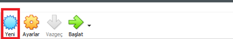
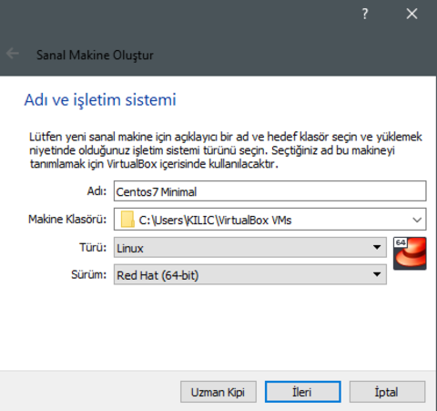
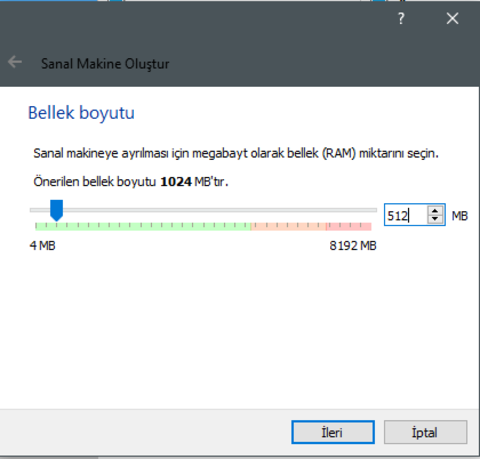
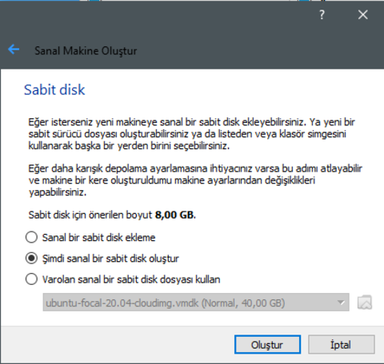
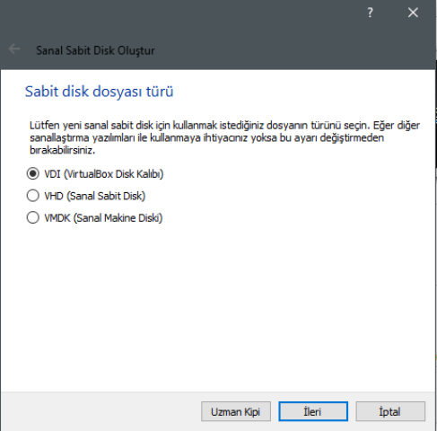
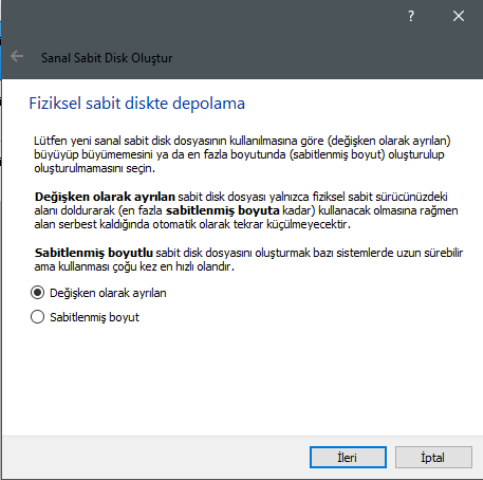
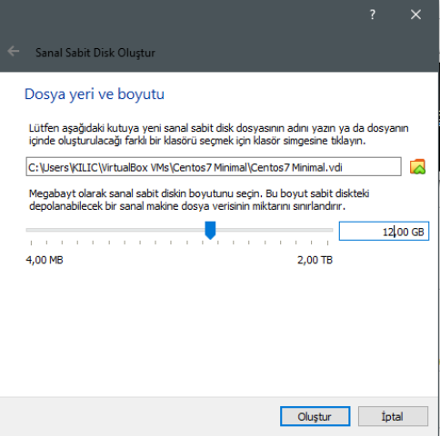
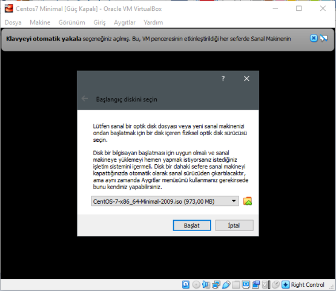
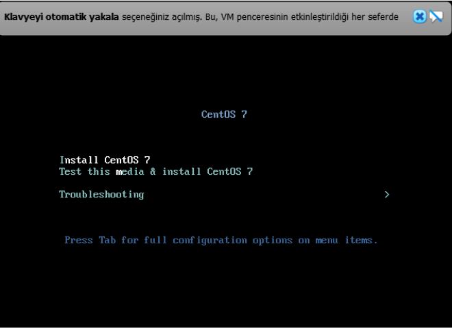
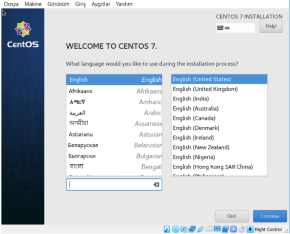
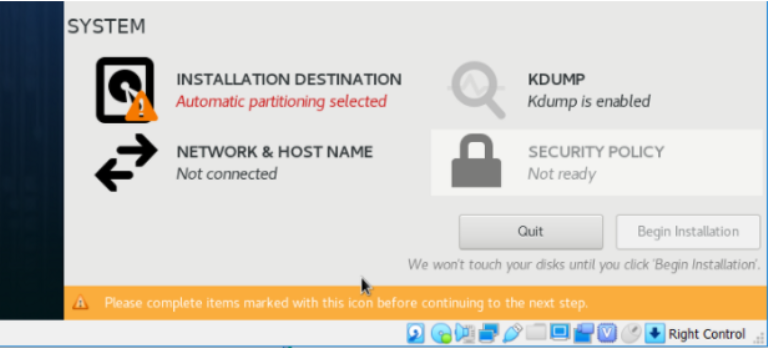
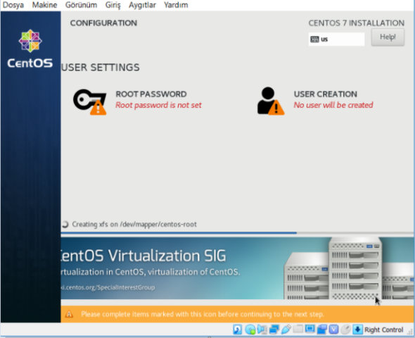
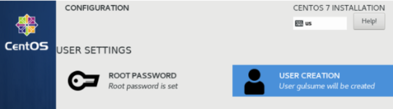
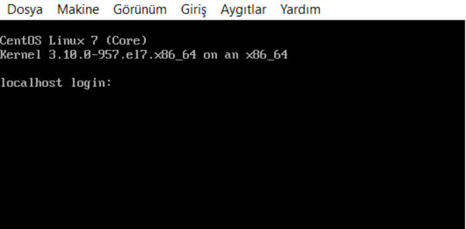

## Kişisel Kullanıcı Yaratılması

```bash
$ adduser bootcampuser
$ paswd bootcampuser
# Sudo yetkileri için 
$ usermod -aG wheel bootcampuser
$ su – bootcampuser # Bundan sonraki adımlarımızı bootcamp user ile yapabilmek için
```

## Sunucuya Disk Eklenmesi
VirtualBox üzerinden disk ayarları yapılmalıdır. Aşağıdaki adımları takip edebilirsiniz.

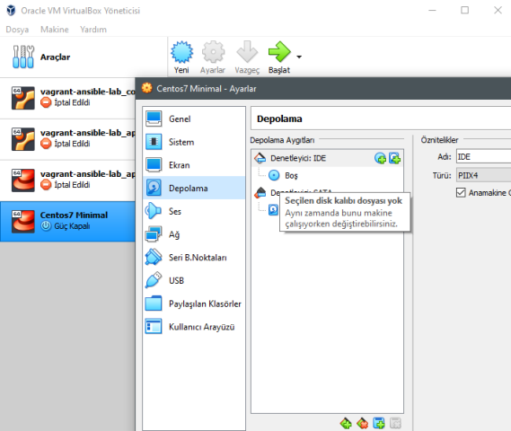
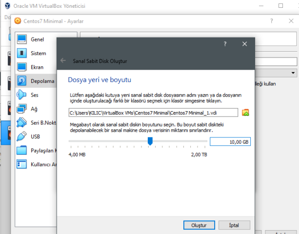

```bash 
# disk kontrolü için
$ ls /dev/sd*
$ /dev/sda /dev/sda1 /dev/sda2

# Bootcamp olarak mount edilmesi 
$ /sbin/mkfs.ext4 -L /bootcamp /dev/sdb1
$ mkdir /bootcamp
$ mount /dev/sdb1 /bootcamp

```

## File oluşturma ve Disk'e Taşıma

```bash
# /opt/bootcamp dizinine bootcamp.txtx dosyası oluşturulması ve dosyaya 'merhaba trendyol' yazılması
$ touch /opt/bootcamp/bootcamp.txt
$ echo 'merhaba trendyol' >> /opt/bootcamp/bootcamp.txt

# Diske taşınması
$ find /opt/bootcamp –type f –name “bootcamp.txt” –exec mv –t /bootcamp {} +

```

# Ansible ile Wordpress (Case 2)
Ansible kurulmuş bir makinemizde hosts dosyası aşağıdaki gibidir.

```
[ubuntu]
app01 ansible_host=192.168.135.111

[centos]
app02 ansible_host=192.168.135.112

[centos:vars]
ansible_python_interpreter=/usr/bin/python

# [control]
# control ansible_connection=local

```

Uygulama için ansible galaxy'den nginx ve docker role'leri indirilir.

```
$ ansible-galaxy install -p roles/ geerlingguy.docker,2.9.0
$ ansible-galaxy install -p roles/ geerlingguy.nginx

```

Ansible requirements.yml dosya içeriği:

```yml
- src: geerlingguy.nginx
  version: 3.0.0

- src: geerlingguy.docker
  version: 2.9.0

```
Nginx üzerinden serve edilen uygulamanın ve gelen request içerisinde bootcamp=devops header'ı varsa "Hoşgeldin Devops" statik sayfasına yönlenebilmesi için gerekli olan index.html sayfası:
```html
<!DOCTYPE html>
<html>
<body>

<h1>Merhaba Trendyol</h1>

</body>
</html>

```
Uygulamamız için playbook oluşturulur. 

```yml
---

- name: Install Docker
  hosts: centos
  become: true
  gather_facts: true
  roles:
    - geerlingguy.docker
    - geerlingguy.nginx

# tasks file for ansible-dockerized-wordpress

  tasks:
  - name: install certain epel-release modules for docker
    yum:
      name: epel-release

  - name: python-pip
    yum:
      name: python-pip

  - name: Copy latest files
    copy:
      src: templates/index.html
      dest: /var/html/index.html

  - name: "Launch database container"
    docker_container:
      name: db
      image: mariadb
      env:
        MYSQL_ROOT_PASSWORD: '123456'
        MYSQL_DATABASE: 'wordpressdb'
        MYSQL_USER: 'bootcamp'
        MYSQL_PASSWORD: '123456'
      restart: 1

  - name: "Launch wordpress container"
    docker_container:
      name: wordpress
      image: wordpress
      links:
        - "db:mysql"
      ports:
        - "8080:80"


```

Grup değişkenlerinin tanımlanması için group_vars/centos/main.yml dosyasında:

```yml
docker_service_state: started
docker_service_enabled: true
docker_restart_handler_state: restarted

nginx_service_state: started
nginx_service_enabled: yes
nginx_error_log: "/var/log/nginx/error.log warn"
nginx_access_log: "/var/log/nginx/access.log main buffer=16k"
nginx_vhosts:
  - server_name: "bootcamp.wordpress.com"
    root: "/var/html"
    index: "index.php index.html index.htm"
    template: "templates/bootcamp.wordpress.com.vhost.j2"
    filename: "bootcamp.wordpress.com.conf"
gzip_enabled: false

```

templates/bootcamp.wordpress.com.vhost.j2 nginx konfigürasyon dosyamız:

```
upstream wordpress {


    server {{ hostvars[item]['ansible_enp0s8']['ipv4']['address'] }}:8080 max_fails=3 fail_timeout=30s;

    server {{ hostvars[item]['ansible_eth1']['ipv4']['address'] }}:8080 max_fails=3 fail_timeout=30s;


}

server {
        listen 80;
        server_name bootcamp.wordpress.com;
        root /var/html
        index index.php index.html index.htm

        gzip on;
        gzip_vary on;
        gzip_min_length 10240;
        gzip_proxied any;
        gzip_types text/plain text/css text/xml text/javascript application/x-javascript application/xml;
        gzip_disable "MSIE [1-6]\.";

        gzip off;

        location / {
                proxy_pass http://wordpress;
                proxy_set_header Host $host;
                proxy_set_header X-Real-IP $remote_addr;
                proxy_set_header X-Forwarded-For $proxy_add_x_forwarded_for;
                proxy_set_header X-Forwarded-Proto $scheme;
        }

        location /bootcamp {

                default_type "text/html";
                try_files $uri.html $uri $uri/ =404;

        }

}


```
Playbook'u çalıştırmak için:


```
$ ansible-playbook -i hosts playbooks/install-docker.yml
```

Hosts dosyamıza domain ismini ekleyip uygulamamızı çalıştırabiliriz.

```
192.168.135.112 bootcamp.wordpress.com

```

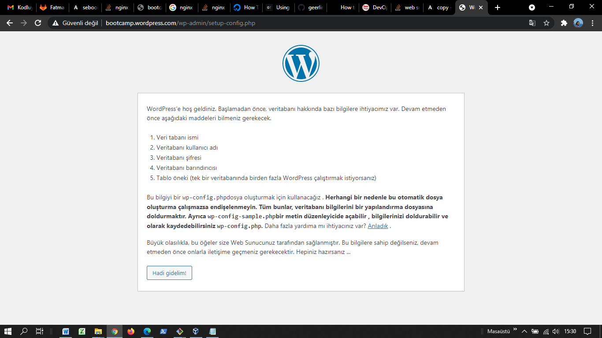


